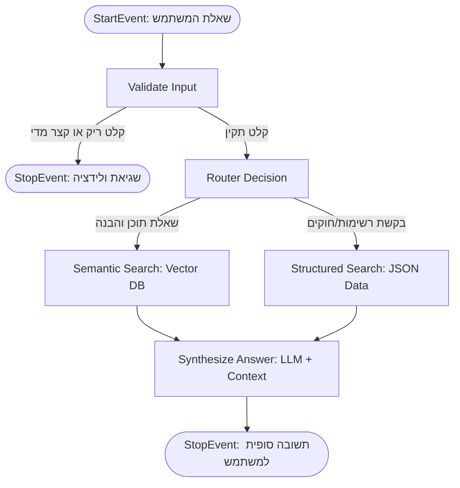

# 🤖 Agentic Docs RAG: Event-Driven Architecture

## 🎯 מטרת הפרויקט
פרויקט זה מציג מערכת **Agentic RAG** (Retrieval-Augmented Generation) מתקדמת, המשמשת כסוכן חכם לתשאול מסמכי תיעוד טכניים של מערכת תוכנה. 

המערכת נבנתה בארכיטקטורת **Event-Driven** (מונחית אירועים) באמצעות `LlamaIndex Workflows`, וכוללת מנגנון ניתוב (Router) אוטומטי. הראוטר מנתח את שאלת המשתמש ומחליט בזמן אמת באיזו אסטרטגיית חיפוש להשתמש:
1. **חיפוש סמנטי (Vector Search):** לשאלות הבנה, ארכיטקטורה ועיצוב.
2. **חיפוש מובנה (Structured Data Extraction):** לשליפת רשימות מדויקות של החלטות (Decisions), חוקים (Rules) ואזהרות (Warnings) מתוך קובץ JSON שחולץ מראש בעזרת Pydantic.

---

## 🏗️ תרשים זרימה (Workflow Architecture)
להלן ארכיטקטורת הניתוב והאירועים של המערכת:



---

## 🚀 איך להריץ את הפרויקט?

### 1. דרישות קדם
* Python 3.10+
* מפתח API של Cohere

### 2. התקנה
שכפלו את המאגר והתקינו את הספריות הנדרשות:
```bash
git clone <your-repo-link>
cd Agentic_RAG_project
pip install -r requirements.txt
```

### 3. הגדרת משתני סביבה
צרו קובץ בשם `.env` בתיקיית השורש של הפרויקט והוסיפו את מפתח ה-API שלכם:
```env
COHERE_API_KEY=your_api_key_here
```

### 4. הכנת הנתונים (Data Extraction)
לפני הרצת הצ'אט, יש להריץ את סקריפט החילוץ שעובר על קבצי ה-Markdown ובונה את מסד הנתונים המובנה (`system_data.json`):
```bash
python extract_data.py
```

### 5. הרצת ממשק המשתמש
הפעילו את שרת ה-Gradio המריץ את ה-Workflow:
```bash
python workflow_rag.py
```

---

## 💡 דוגמאות לשאלות שה-Agent יודע לענות עליהן

ה-Agent ינתב את השאלות הבאות באופן אוטומטי למנוע החיפוש הנכון:

🔍 **שאלות המנותבות לחיפוש הסמנטי (Vector DB):**
* "מה הצבע העיקרי של המערכת?" (שולף מידע מקבצי ה-UI).
* "איך עובדת הארכיטקטורה של הפרונטאנד?" (שולף מידע מקבצי התכנון).

📊 **שאלות המנותבות לחיפוש המובנה (Structured JSON):**
* "תן לי רשימה של כל האזהרות (Warnings) והדברים הרגישים בפרויקט."
* "אילו החלטות טכניות התקבלו בארכיטקטורה?"
* "מהם חוקי הפיתוח המוגדרים למערכת?"

🛡️ **שאלות הנחסמות בשלב הולידציה:**
* "היי" -> יחזיר שגיאה ויבקש מהמשתמש לנסח שאלה מפורטת יותר כדי לחסוך קריאות מיותרות ל-LLM.

---

## 🧠 רפלקציה ותובנות מתהליך הפיתוח

**1. על איזה שאלות ה-Agent לא מסוגל לענות (עדיין...)?**
ה-Agent עדיין מתקשה לענות על שאלות שדורשות מטא-דאטא חיצוני או הצלבת נתונים סטטיסטית, כגון: "כמה קבצי Markdown יש בפרויקט בסך הכל?" או שאלות התלויות בזמן אמת כמו "מי המפתח האחרון שערך את קובץ ה-UI?". לשם כך נדרש לשלב כלים חיצוניים (Function Calling / Tools) מעבר לקריאת מסמכים.

**2. האם ה-Agent מצליח לזהות מתי להפעיל כל סוג חיפוש?**
ברוב המוחלט של המקרים, ה-Router מקבל החלטה מדויקת בזכות Prompt Engineering קפדני. עם זאת, במקרי קצה שבהם השאלה מנוסחת בעמימות (למשל: "מהם החוקים לגבי הצבעים?"), ה-LLM עשוי להתלבט בין שליפת רשימת החוקים לבין חיפוש סמנטי של עיצוב.

**3. מה היית מוסיפה או משדרגת ב-Agent?**
* **Self-Correction (מנגנון תיקון עצמי):** הוספת אירוע שאם החיפוש הסמנטי מחזיר תוצאות ברמת Confidence נמוכה, ה-Workflow ייצר Event חדש שמנסח את השאלה מחדש (Query Rewriting) או מנסה לשלוף את התשובה ממסד הנתונים המובנה כגיבוי.
* **ניהול היסטוריה (State Management):** שמירת ההקשר (Context) של השיחה בין Events כדי לאפשר שאלות המשך (Follow-up questions) טבעיות יותר.

**4. האם קרה ששינוי קטן שינה את איכות התפקוד בצורה משמעותית?**
כן, פעמיים:
* בשלב חילוץ הנתונים (Data Extraction), המודל נטה להמציא שדות (כמו שדה `title` לחוקים) למרות סכמת ה-Pydantic, מה שגרם לשגיאות ולידציה. הוספת תבנית JSON מלאה ומפורשת ב-Prompt (כולל דוגמה חזותית של מבנה הנתונים) העלתה את אחוזי ההצלחה בחילוץ ל-100%.
* מעבר מ-API מיושן (`Generate`) ל-API המודרני (`Chat`) של המודל שיפר משמעותית את איכות התשובות והיציבות. בנוסף, הוספת מנגנון השהיה (Sleep) מנעה קריסות של Rate Limit.